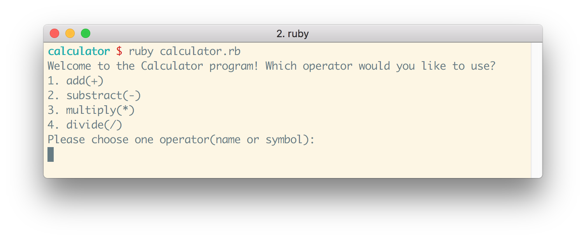

# Calculator Exercise

## At a Glance

- Individual, [stage 1](https://github.com/Ada-Developers-Academy/pedagogy/blob/master/classroom/rule-of-three.md#stage-1) project
- Due before class, **DATE HERE**

## Learning Goals

- Write Ruby code with statements that practice conditional logic, using `if`, `elsif`, and `else` when appropriate
- Write Ruby code with statements that practice loops, like `while` and `until` when appropriate
- Write Ruby code that takes in user input using `gets.chomp`
- Practice creating, storing, and modifying variables
- Practice creating and using methods

## Objective

We will build a calculator command line interface (CLI) that allows any user to interact with the command line to perform simple arithmetic. The program should ask the user to type in and enter in pieces of input. Based on the input that the user typed in, the program should output its evaluation.

## Getting Started

You should write your program as a series of statements within a file `calculator.rb`. Anyone with this file should be able to run the command `$ ruby calculator.rb` to execute the program.

## Implementation Requirements

When a user runs this program, the program should ask the user for the following things:

1. a math operation
1. a number for the math operation
1. a second number for the math operation

The program should use the input operation and two numbers to provide the result of applying the operation to the two numbers.

- The program should have support for these four operations: addition, subtraction, multiplication, and division.
- The program should accept both the name and the symbol for each possible operation. The expected names and symbols for each operation are the following:
  - `add` and `+`
  - `subtract` and `-`
  - `multiply` and `*`
  - `divide` and `/`
- You may add other names or symbols to the above operations
- There is no requirement to consider handling uppercase versions to the command above: you are required only to handle the lowercase versions of the operations above
- The program should gracefully handle unexpected user input by doing the following things:
  - check if the input is invalid. What happens if the user input is `nil` (i.e., the user just pressed enter)? What happens if the user tries to `add` `hotdog` to `elephant`? What if the user input is `hotdog` for an operator?
  - if the input is invalid, output a message to the command line that informs the user that the input was invalid
  - exit the program


Here is an example of what your program could look like. It is not required to look exactly like this:

**NOTE:**
```
You will be turning this project in.
We will go over how to review the project at the time of submission.
```

## Testing and Verification Requirement

Before project submission, test and verify that your program works as expected with the following testing/verification requirements.

To make sure your program works you will need to run your program and check against the following criteria:
*  The program adds numbers accurately with both `add` and `+`
*  The program subtracts numbers accurately with both `subtract` and `-`
*  The program multiplies numbers accurately with both `multiply` and `*`
*  The program divides numbers accurately with both `divide` and `/`
*  The program responds with user-friendly output (instead of an error message) when the user attempts to divide by zero
*  The program handles erroneous input.  For example the user might enter `clown` when asked to enter a number
    *  The program also needs to handle erroneous operators

## Optional Enhancements

The following is a list of optionals. Should you be ambitious to continue working on this project beyond the requirements, here is a list of features that are interesting. These enhancements are not listed in any particular order; feel free to pick an enhancement from anywhere in the list!

- Gracefully handle unexpected/erroneous user input with the following method:
  - output a message to the command line that informs the user that the input was invalid
  - asks the user to re-enter the input for the same prompt
  - does this until the input is valid
  - uses the newer, valid input
- Print out the formula in addition to the result, i.e. `2 + 2 = 4`
- Add support for computing exponents (`2^4 = 2 * 2 * 2 * 2 = 16`)
- Add support for the modulo operator (`10 % 3 = 1`).
- Make your program know when it needs to return an _integer_ versus a _float_.
- Add support for parentheticals, i.e. `10 / (5 + 5) = 1`.
- Add support for handling all cases (uppercase, capitals) for the operations, so that `ADD` and `add` and `Add` (and other combinations) are handled in the same way

Please note that you will only be graded on the requirements, and not on the optional enhancements.

## What Instructors Are Looking For

Check out the [feedback template](feedback.md) which lists the items instructors will be looking for as they evaluate your project.
